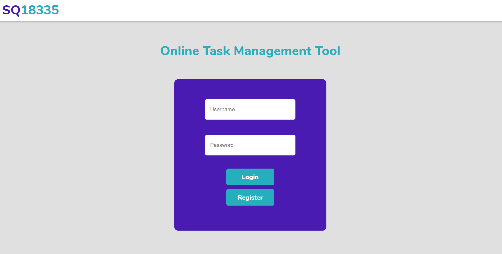
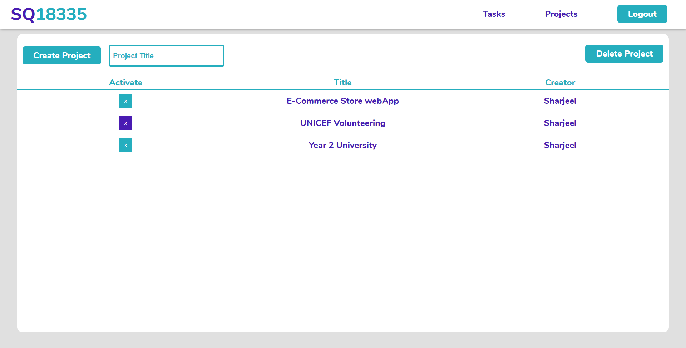
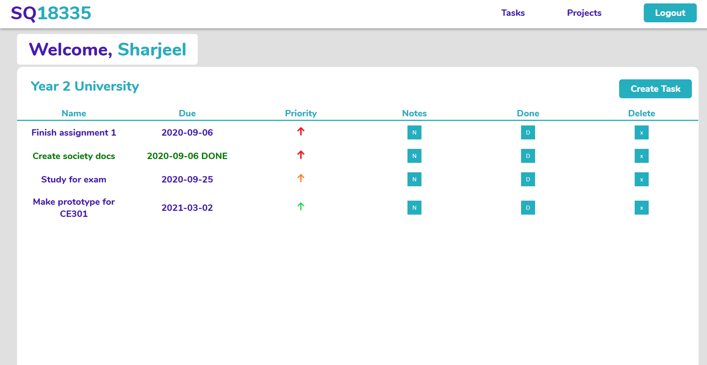

# OTMT
Online task management tool

https://otmt.herokuapp.com/

Features:
- Registration/Login System
- Project mangement System
- Task management Sub-system
- Task due dates, priorities and notes
- Mark tasks with their current progression status

#### Users are able to create their own username and password which is securely stored and encrypted on Heroku's servers

#### Users are able to create multiple projects and mark the one they wish to work on as active, which will store different subtasks

#### Users are able to create tasks, sort them by priority, specify their due takes, mark them as done, delete them and add custom notes to each task

